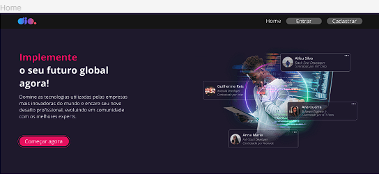
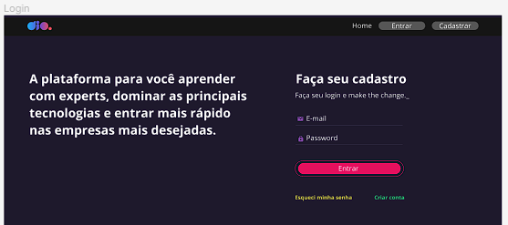
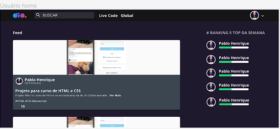
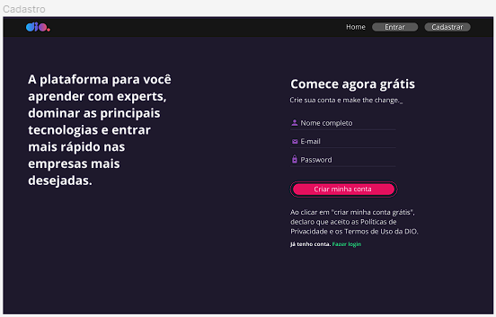

<h1 align="center">DIO Clone</h1>

Projeto feito durante a formação React Developer, onde o maior objetivo foi mostrar como utilizar a navegação em uma aplicação React, com o React-Router-Dom.  

  <a href="#-tecnologias">Tecnologias</a>&nbsp;&nbsp;&nbsp;|&nbsp;&nbsp;&nbsp;
  <a href="#-projeto">Projeto</a>&nbsp;&nbsp;&nbsp;|&nbsp;&nbsp;&nbsp;
  <a href="#-layout">Layout</a>&nbsp;&nbsp;&nbsp;|&nbsp;&nbsp;&nbsp;
  <a href="#-aprendizado">Aprendizado</a>&nbsp;&nbsp;&nbsp;|&nbsp;&nbsp;&nbsp;
  <a href="#-licença">Licença</a>

  

 

  

  

  

  

---
## 🚀 Tecnologias

Esse projeto foi desenvolvido com as seguintes tecnologias:

- HTML e CSS
- JavaScript
- React
- Figma
- Git e Github

---
## 💻 Projeto

O Projeto DIO Clone consiste em mostrar uma maneira de utilizar a navegação entre páginas dentro de uma aplicação React, desenvolvendo um clone da plataforma DIO. 
Com as páginas de Login, Home, Cadastro e Home Page do usuário.

---
## 🔖 Layout

Você pode visualizar o layout do projeto através [Desse Link](https://www.figma.com/file/fvjQQNtqaUdpuNixvCZVav/DIO-CLONE?type=design&node-id=0-1&mode=design&t=xCWUvKXozf1kAYwv-0). É necessário ter conta no [Figma](https://figma.com) para acessá-lo.

---
## 📑 Aprendizado

Durante o desenvolvimento deste projeto utilizei o React-Router-Dom para realizar a navegação entre as páginas.  
Foi utilizado o styled-components para a estilização da aplicação, facilitando o desenvolvimento, deixando a reutilização de componentes mais fácil e possibilitando colocar regras nas estilizações.  
Para a navegação foi utilizado o useNavigate, um hook do próprio React.

---
## 📝 Licença

Esse projeto está sob a licença MIT.

---

Feito com ♥ por Gustavo Zamai
